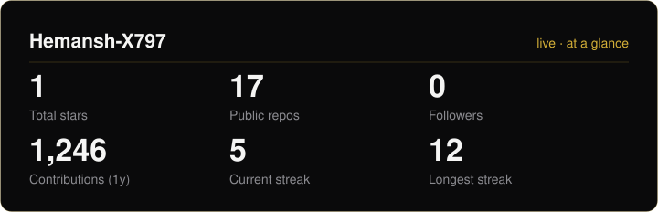

<div align="center">

<picture>
  <source media="(prefers-color-scheme: dark)" srcset="assets/hero-dark.svg">
  <source media="(prefers-color-scheme: light)" srcset="assets/hero-light.svg">
  
</picture>

<br><br>

<a href="https://hemansh.vercel.app"></a>
<a href="https://palspace.vercel.app/hemansh"></a>
<a href="https://linkedin.com/in/hemansh-mishra"></a>
<a href="https://x.com/_Hemansh"></a>
<a href="https://instagram.com/Hemansh.xo_"></a>
<a href="https://open.spotify.com/user/h9k7u5o394b1pl4zcz5stp2ur"></a>

<a href="mailto:kundansmishra@gmail.com"></a>


</div>

---

## `~/` whoami

```console
$ cat about.txt
```

systems architect, polymath. I build the layer most people don't touch --
kernels, browsers, compute engines -- then build the app that sits on top
of it too.

- Building **V.I.N.C.E.** -- a custom OS kernel, on bare metal (private, for now)
- Shipped **Aether** -- a browser built around speed, adblocker baked in
- Shipped **Hyperion** -- a GPU / compute engine for heavy workloads
- Shipped **Pulse** -- the backend for **[Palspace](https://palspace.vercel.app/hemansh)**, my social app
- Portfolio: **[hemansh.vercel.app](https://hemansh.vercel.app)**

<br>

<div align="center">

## `~/` toolbox


</div>

---

<div align="center">

## `~/` skill radar

<table>
<tr>
<td width="50%" align="center" valign="middle">

<!-- self-rated -- edit data/skills.json, the workflow redraws this -->
<picture>
  <source media="(prefers-color-scheme: dark)" srcset="assets/radar-dark.svg">
  <source media="(prefers-color-scheme: light)" srcset="assets/radar-light.svg">
  
</picture>

</td>
<td width="50%" align="center" valign="middle">

<!-- live -- real language byte counts across every repo, via the API -->
<picture>
  <source media="(prefers-color-scheme: dark)" srcset="assets/radar-langs-dark.svg">
  <source media="(prefers-color-scheme: light)" srcset="assets/radar-langs-light.svg">
  
</picture>

</td>
</tr>
</table>

</div>

---

<div align="center">

## `~/` coding habits


<br><br>

## `~/` contribution calendar


<br><br>

<picture>
  <source media="(prefers-color-scheme: dark)" srcset="assets/snake-dark.svg">
  <source media="(prefers-color-scheme: light)" srcset="assets/snake-light.svg">
  
</picture>

</div>

---

<div align="center">

## `~/` the numbers

<picture>
  <source media="(prefers-color-scheme: dark)" srcset="assets/card-stats-dark.svg">
  <source media="(prefers-color-scheme: light)" srcset="assets/card-stats-light.svg">
  
</picture>

<br>


<br><br>


</div>

---

<div align="center">

## `~/` selected work

<picture>
  <source media="(prefers-color-scheme: dark)" srcset="assets/projects-dark.svg">
  <source media="(prefers-color-scheme: light)" srcset="assets/projects-light.svg">
  
</picture>

<sub>

| project | status | stack |
|---|---|---|
| **[V.I.N.C.E.](https://github.com/Hemansh-X797/V.I.N.C.E.)** | private -- kernel dev | `C` |
| **[Aether](https://github.com/Hemansh-X797/Aether)** | public | `C++` |
| **[Hyperion](https://github.com/Hemansh-X797/Hyperion)** | private | `C++` |
| **[Pulse](https://github.com/Hemansh-X797/Pulse)** | public -- [live](https://palspace.vercel.app/hemansh) | `TypeScript` |

</sub>

</div>

---

<div align="center">

<sub>`01110011 01101000 01101001 01110000 01110000 01101001 01101110 01100111`</sub>

</div>
